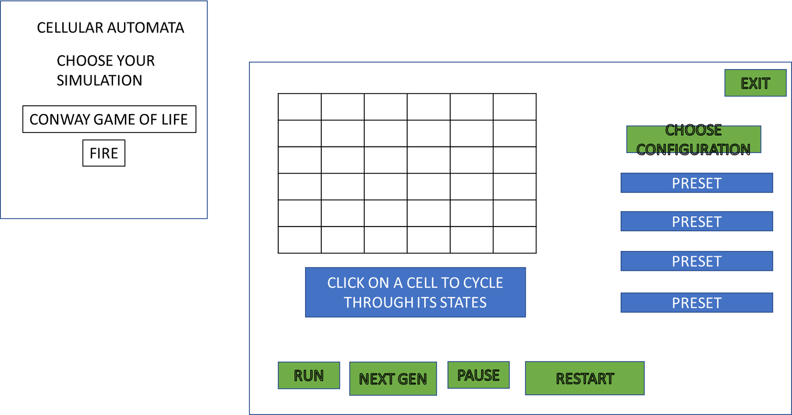

# Simulation Design Plan
### Team Number 1
### Joshua Boss, Alex Chao, Franklin Wu

## Design Overview

## Packages/Classes

Model 
 * FileReader
 * Cell (Abstract) 
    * ConwayCell
 * Game (Abstract)
    * Each new simulation is its own class

View
 * SplashScreen 
 * Display

 
Controllers
 * InputHandler
 * 

minimize communication between model and view 

## Error Handling 

* Model handles invalid input files 

## Design Details

* how does view know how to set the color of cells 

Here is a graphical look at my design:

made from [a tool that generates UML from existing code](http://staruml.io/).

## Design Considerations

* does view read in configuration file 
  * yes 
    * pros: needs less information from model, could set up an initial state and test it without 
    needing model or controller
    * cons: there still needs to be a way to communicate information, 
  * no 
    * pros: 
    * cons: 

* clicking a cell to change its state, how does this information pass from view to model 
 * controller handles the input and tells model to change its cell 

* how to split up model and view 
  * 
* running multiple games at once 

## User Interface

* Home Screen 
 * Choose Simulation 

* Simulation 
 * Initial config
 * pause 
 * run 
 * restart
 * next gen (single step)
 * return to home screen 
 * clicking on cells cycles through its state

Here is our amazing UI:

taken from [Brilliant Examples of Sketched UI Wireframes and Mock-Ups](https://onextrapixel.com/40-brilliant-examples-of-sketched-ui-wireframes-and-mock-ups/).

## Team Responsibilities

## Plan 

how does model communicate with view 

## Things that can be done separately 

* 
* cell class 
* game board 
* rules for Game of Life

* how to load in a CSV 

 * Franklin: Model simulation for Conway 

 * Joshua: buttons in view and saving a configuration 
 
 * Alex: reading in the file, displaying it in view, loading in a new file 

Click a game -> view loads that from model, loads in corresponding CSS